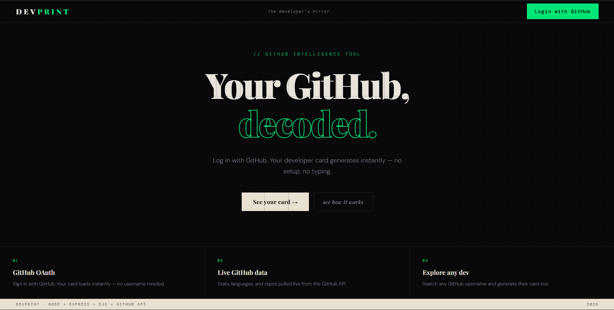
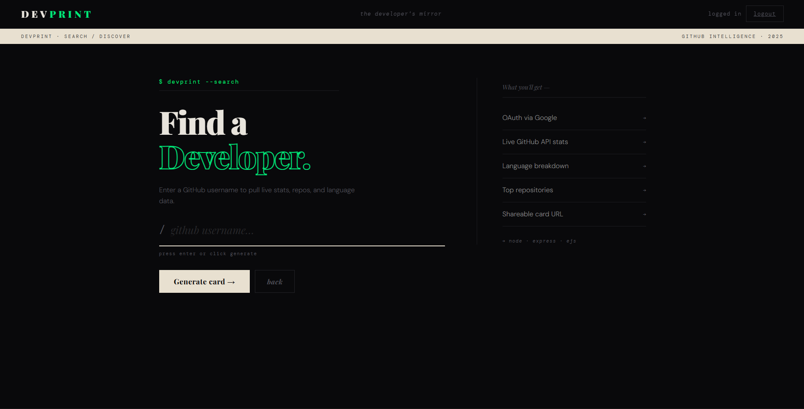
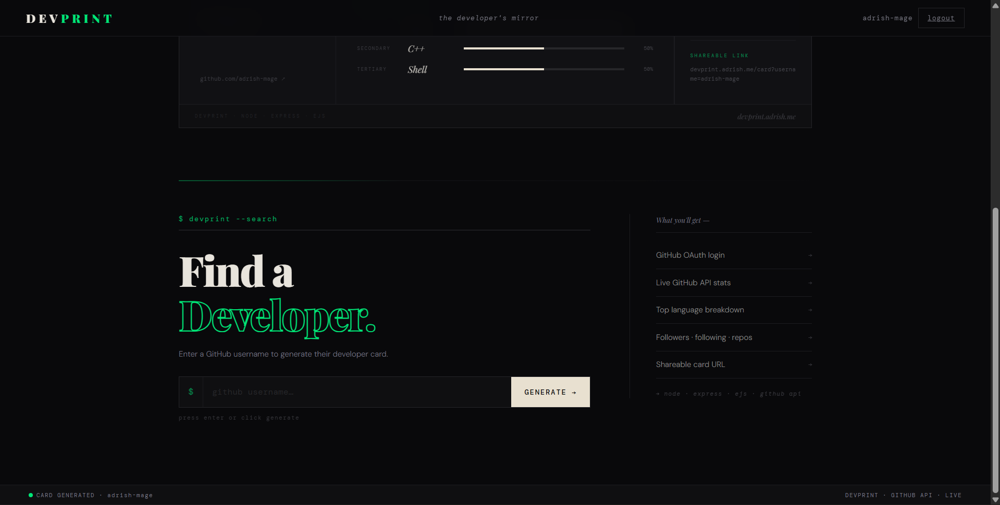
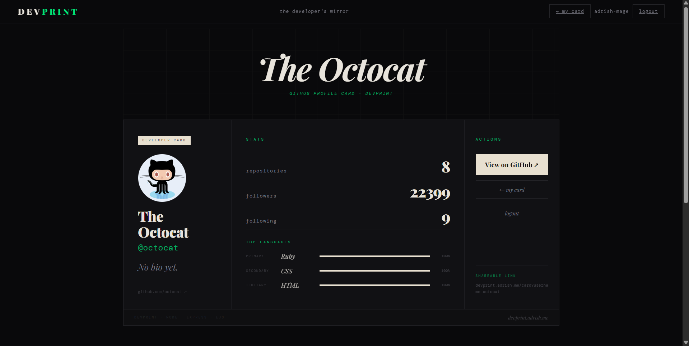

<div align="center">

# DevPrint
**Your GitHub identity, decoded.**

[](https://devprint.adrish.me/)
[](https://nodejs.org)
[](https://expressjs.com)
[](https://auth0.com)

</div>

---

<p align="center">
  <a href="https://devprint.adrish.me">
    
  </a>
</p>
<p align="center">
  
</p>
<p align="center">
  
</p>
<p align="center">
  
</p>

---

DevPrint pulls your GitHub identity through OAuth, crunches your repo data server-side, and spits out a developer card. No forms, no manual input — you log in and your card is already there. You can search any other GitHub user from the same page.

No database. No third-party stats widgets. Language breakdown is computed from raw API responses across up to 100 repos.

---

## Stack

| Layer | Tech |
|---|---|
| Runtime | Node.js 20 |
| Server | Express 4 |
| Templating | EJS |
| Auth | Auth0 · GitHub OAuth (OpenID Connect) |
| Data | GitHub REST API v3 |
| Deployment | Render + Namecheap domain |
| Uptime | UptimeRobot — pings `/healthz` every 14 min |

Auth0 handles the OAuth complexity (token exchange, session management, provider config) so the app logic stays focused on the GitHub data layer. EJS over a frontend framework — there's no client-side state to manage, server rendering is simpler and faster for this use case.

---

```
GET /          →  unauthenticated → landing
               →  authenticated  → /card

GET /card      →  pulls github username from session (req.oidc.user.nickname)
               →  Promise.all: profile + repos fetched in parallel (100 repo cap)
               →  language frequency computed server-side from raw repo objects
               →  renders card.ejs with data + inline search form

GET /card?username=x  →  same pipeline, different target
                      →  error → refetches own card, renders inline error (no dead pages)
```

Auth is handled by `express-openid-connect`. Username comes straight from the OAuth session token — no user input needed for your own card. No tokens stored; session lives in a signed cookie.

---

## Routes

| Route | Auth | |
|---|---|---|
| `GET /` | — | Landing — redirects to `/card` if logged in |
| `GET /login` | — | Kicks off GitHub OAuth via Auth0 |
| `GET /callback` | — | Auth0 redirect target |
| `GET /logout` | ✓ | Clears session |
| `GET /card` | ✓ | Your card, auto-generated from session |
| `GET /card?username=x` | ✓ | Any GitHub user's card |
| `GET /healthz` | — | JSON status + uptime (keep-alive target) |

---

## Local setup

```bash
git clone https://github.com/adrish-mage/devprint.git
cd devprint
npm install
cp .env.example .env
node index.js
```

`.env`:

```env
AUTH0_SECRET=           # openssl rand -hex 32
AUTH0_BASE_URL=http://localhost:3000
AUTH0_CLIENT_ID=
AUTH0_CLIENT_SECRET=
AUTH0_ISSUER_BASE_URL=  # https://auth0-tenant.auth0.com
GITHUB_TOKEN=           # PAT with public_repo read scope
PORT=3000
```

Auth0 needs **GitHub as a social connection** and `http://localhost:3000/callback` whitelisted.

---

## What's notable

- OAuth identity drives the card — `req.oidc.user.nickname` gives the GitHub username directly from the session, no form needed
- `Promise.all` for parallel API calls — profile and repos fetched simultaneously, not sequentially
- Language breakdown computed server-side from raw repo objects — no widget, no third-party API
- Failed username searches fall back to your own card with an inline error instead of a dead page

---

## Roadmap

- [ ] MongoDB caching with TTL — GitHub's REST API has a 60 req/hr limit for unauthenticated calls; caching repo data per user kills that bottleneck
- [ ] `/u/:username` — public permalink so cards are shareable without login
- [ ] PNG export — card as a downloadable image, useful for profiles and bios

---

## Author

**Adrish Dey** — IT, Calcutta University  
[github.com/adrish-mage](https://github.com/adrish-mage) · [linkedin.com/in/adrish](https://www.linkedin.com/in/adrish-dey-6b2286385/)

---

*MIT*
